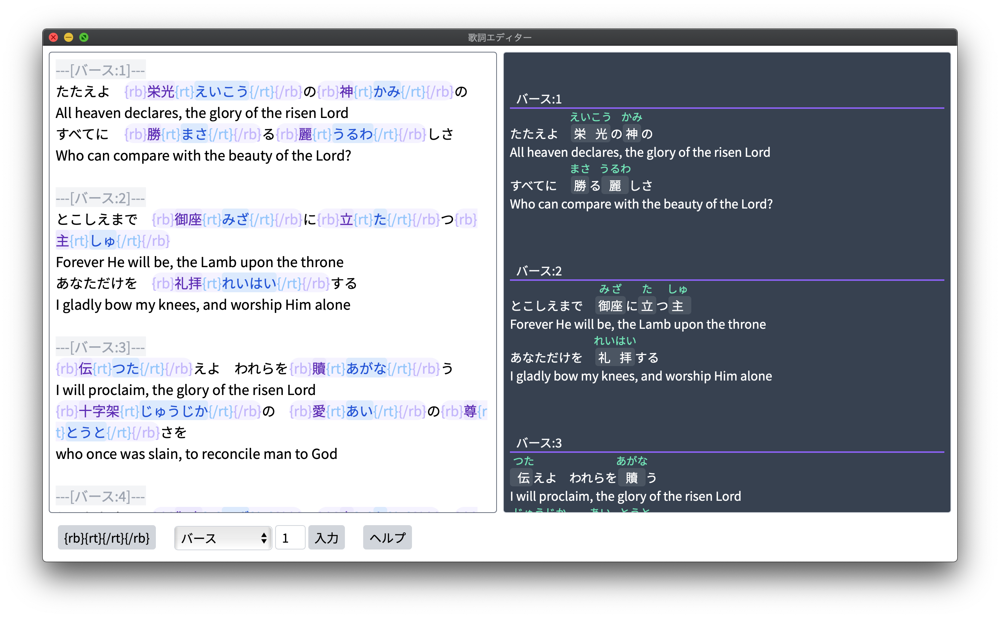

# Kashi Editor

This editor is for editing lyrics for use with OpenLP projection software. It is targeted towards quickly being able to edit Japanese text.

The GUI interface is in Japanese.

## Screenshots

## Installation

Right now no binary file is available.

### Windows

Requires python 3.8 for windows because of a dependency for pywebview. It seems that this can be resolved by first installing pybonnit independantly.

- `pip install pywebview`
- `pip install pywebview[cef]`

I am unsure if webview2 is required.

### MacOS

- `pip install pywebview`

## Compilation

### Windows
- use pyinstaller
- likely requires adding the pyinstaller hook manually to site packages from [here](https://github.com/cztomczak/cefpython/tree/master/examples/pyinstaller) and also modifing the hookspath in the `.spec` file: `hookspath=["."]` see [this issue](https://github.com/r0x0r/pywebview/issues/369)

`pyinstaller --noconsole --onefile --add-data "assets/*;assets" kashiedit.py`

### Mac
- can use py2app

## How to Use

### Basic Usage

1. Copy text from OpenLP
2. Paste it into kashiedit
3. After editing text, copy and paste it back into OpenLP

### More info and Shortcut Keys

Tags are configured to be like this:

`{rb}KANJI{rt}READING{/rt}{/rb}`

In OpenLP you must configure these formatting tags to be used. It is the same format as html but shortened for brevity. `<ruby>KANJI<rt>READING</rt></ruby>`. Squiggly brackets are used by OpenLP.

`Ctrl+R` will insert tags. With no selection the cursor will be moved to the KANJI spot. If there is a selection it will use that for KANJI and automatically move the cursor to the READING spot.

There is an option selection menu for inserting separators in OpenLP syntax.

`Ctrl+1` to insert verse separator.

`Ctrl+2` to insert a chorus separator.

`Ctrl+3` to insert a bridge separator.

`Ctrl+u` will increment the number by 1.

`Ctrl+d` will decrement the number by 1.

## Roadmap

- [x] live preview
- [x] syntax highlighting of tags
- [x] insertion of tags
- [x] insertion of song part separators
- [x] basic keyboard shortcuts
- [ ] improvement: song part separators should always go on a new line (not in middle of lyrics)
- [ ] code improvement: refactor javascript functions into python api
- [ ] map tab / shift+tab to navigate through kanji and readings quickly
- [ ] smart deletion of tags (cursor is in a tag set, delete that set but just leave the kanji)
- [ ] button to remove all tags (but leave all kanji/words)
- [ ] button to auto add tags for all kanji (with no readings)
- [ ] button for auto tagging all kanji and insert the readings (using sudachipy)
- [ ] UI: show/hide preview button
- [ ] UI: handle to horizontally resize the editor/preview split

## Special Thanks

- This project is using tailwindcss. Thank you to the folks at [tailwindcss.com](www.tailwindcss.com).
- Credit to syntax highlighting idea from [css-tricks.com](https://css-tricks.com/creating-an-editable-textarea-that-supports-syntax-highlighted-code/). I had to adapt that idea for this project but the initial help came from there. 
